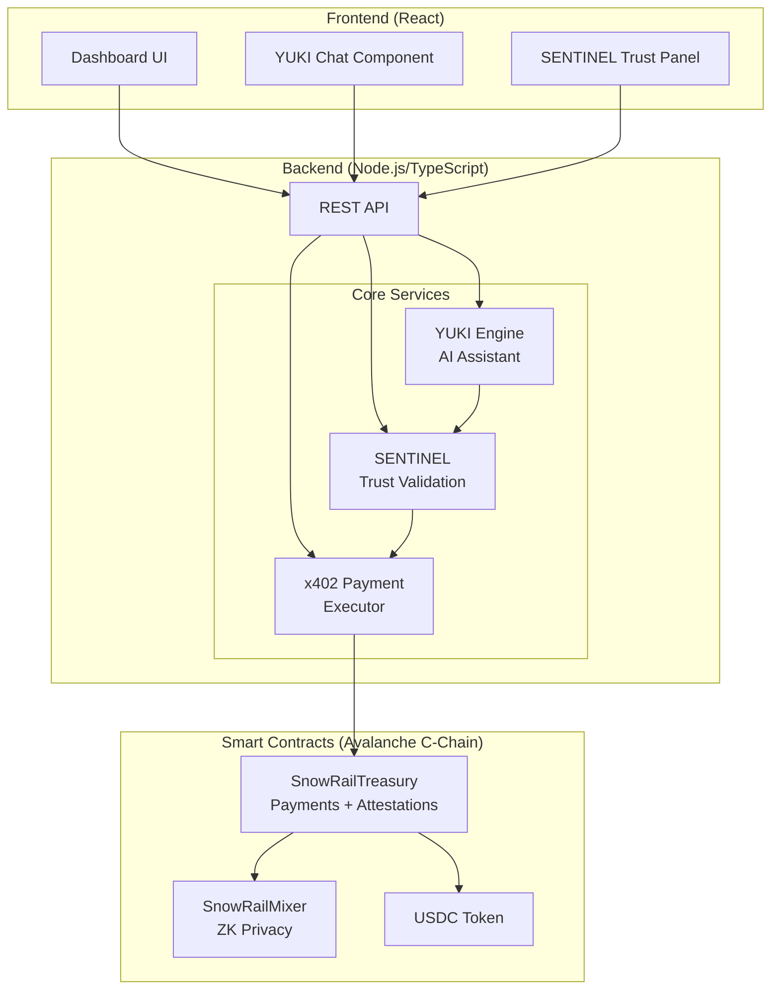
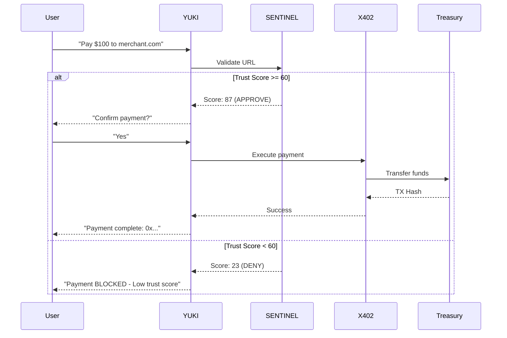
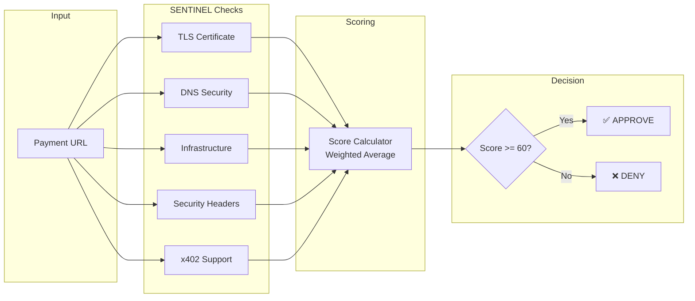
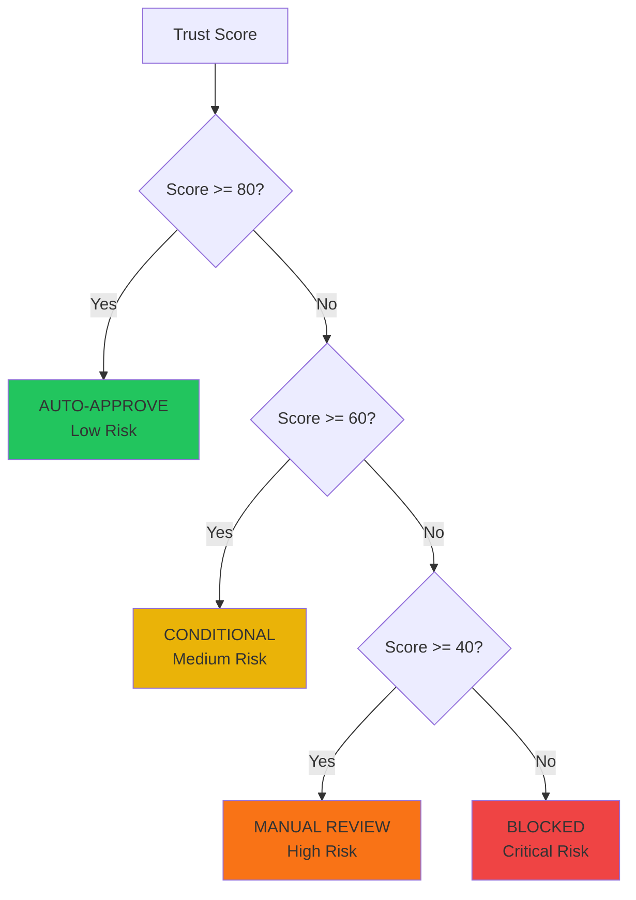
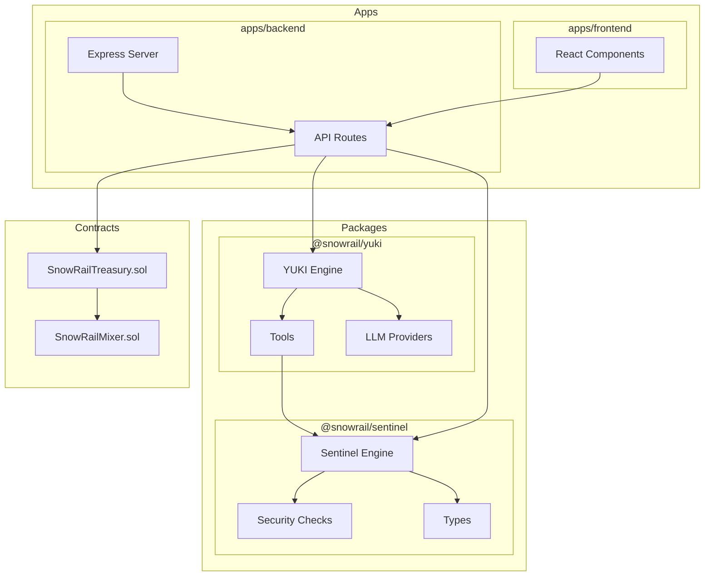

# SnowRail Architecture Diagrams

## System Architecture



## Payment Flow



## SENTINEL Validation Flow



## Trust Score Decision Matrix



## Component Architecture



## Data Flow

```
┌─────────────────────────────────────────────────────────────────┐
│                         USER REQUEST                            │
│                    "Pay $100 to merchant.com"                   │
└─────────────────────────────────────────────────────────────────┘
                                │
                                ▼
┌─────────────────────────────────────────────────────────────────┐
│                          YUKI ENGINE                            │
│                    Parse intent + Extract URL                   │
└─────────────────────────────────────────────────────────────────┘
                                │
                                ▼
┌─────────────────────────────────────────────────────────────────┐
│                      SENTINEL VALIDATION                        │
│  ┌──────────┐ ┌──────────┐ ┌──────────┐ ┌──────────┐           │
│  │   TLS    │ │   DNS    │ │  INFRA   │ │  POLICY  │           │
│  │  Check   │ │  Check   │ │  Check   │ │  Check   │           │
│  └────┬─────┘ └────┬─────┘ └────┬─────┘ └────┬─────┘           │
│       │            │            │            │                  │
│       └────────────┴────────────┴────────────┘                  │
│                         │                                       │
│                         ▼                                       │
│              ┌─────────────────────┐                            │
│              │   TRUST SCORE: 87   │                            │
│              │    RISK: LOW        │                            │
│              │  DECISION: APPROVE  │                            │
│              └─────────────────────┘                            │
└─────────────────────────────────────────────────────────────────┘
                                │
                                ▼
┌─────────────────────────────────────────────────────────────────┐
│                    USER CONFIRMATION                            │
│              "Confirm payment of $100? [Yes/No]"                │
└─────────────────────────────────────────────────────────────────┘
                                │
                                ▼
┌─────────────────────────────────────────────────────────────────┐
│                     x402 PAYMENT EXECUTOR                       │
│                                                                 │
│  ┌─────────────────────────────────────────────────────────┐   │
│  │              SNOWRAIL TREASURY CONTRACT                 │   │
│  │  • Transfer USDC                                        │   │
│  │  • Record attestation                                   │   │
│  │  • Emit PaymentExecuted event                          │   │
│  └─────────────────────────────────────────────────────────┘   │
└─────────────────────────────────────────────────────────────────┘
                                │
                                ▼
┌─────────────────────────────────────────────────────────────────┐
│                         RESULT                                  │
│           TX: 0x1234...abcd | Status: COMPLETED                │
│           View on Snowtrace: [link]                            │
└─────────────────────────────────────────────────────────────────┘
```
